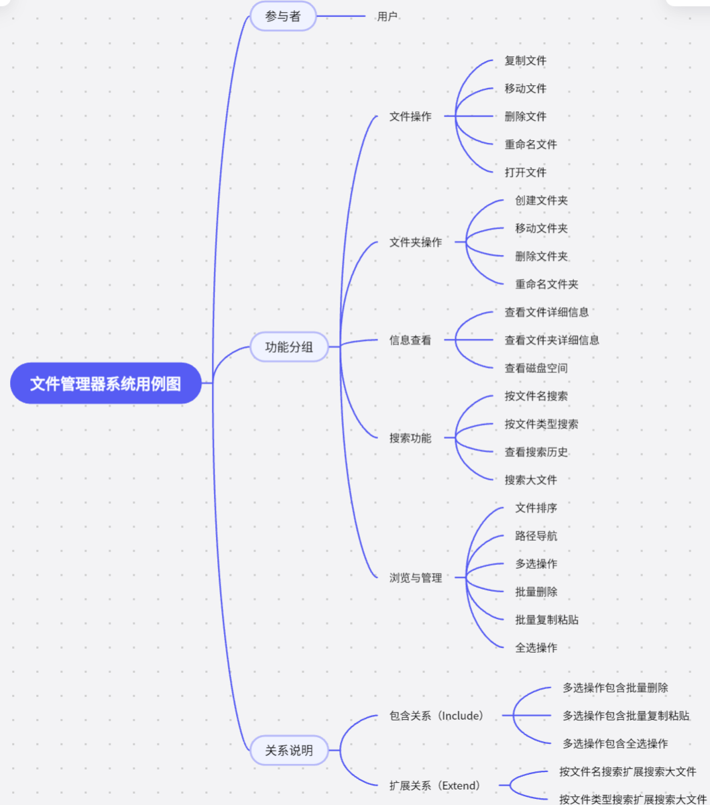
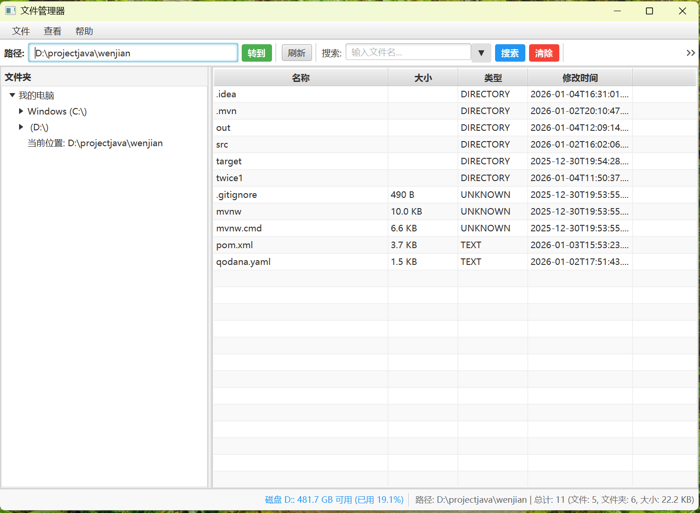
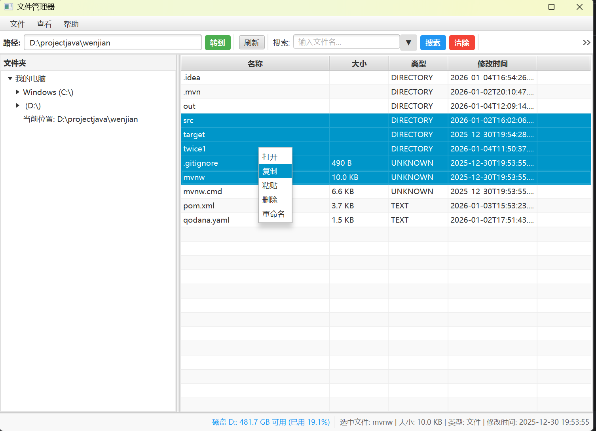
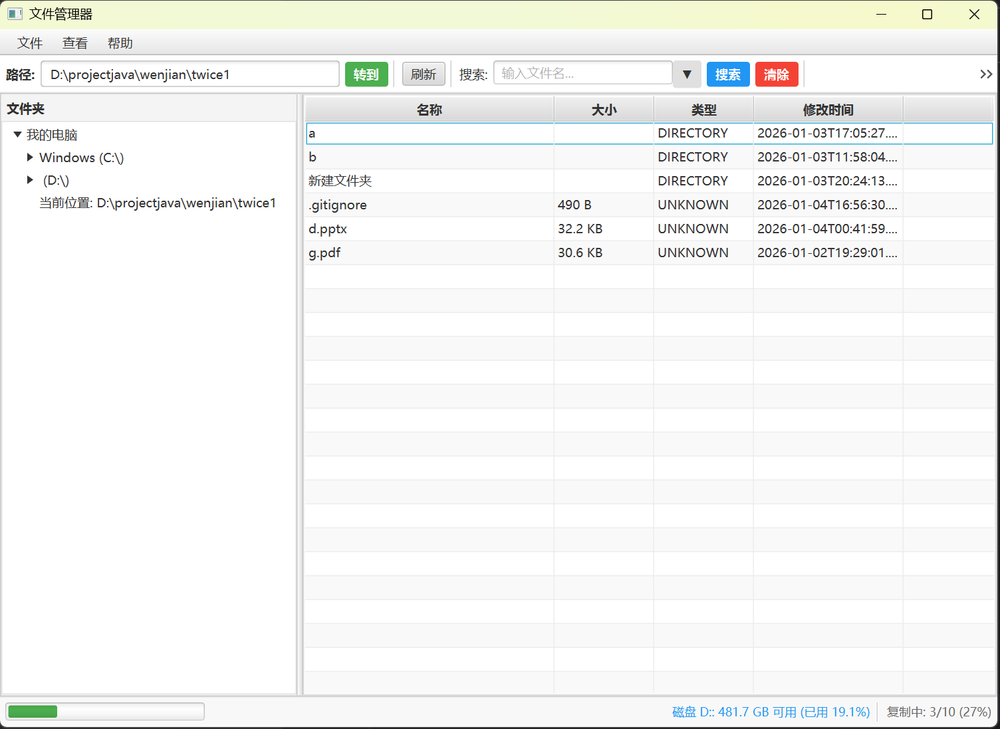
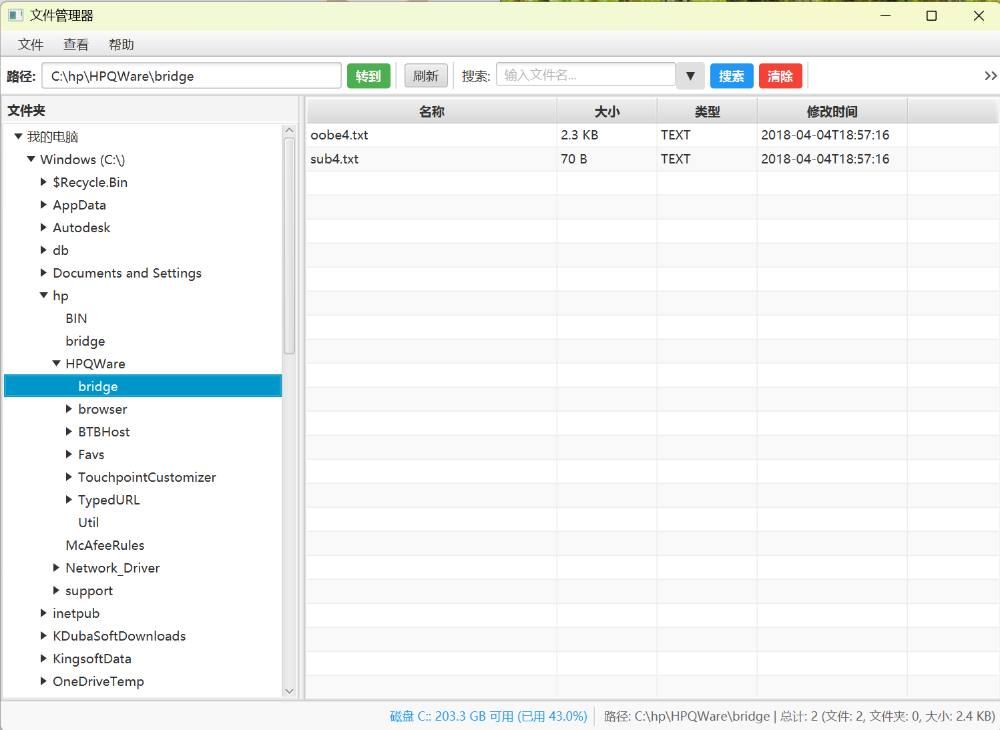
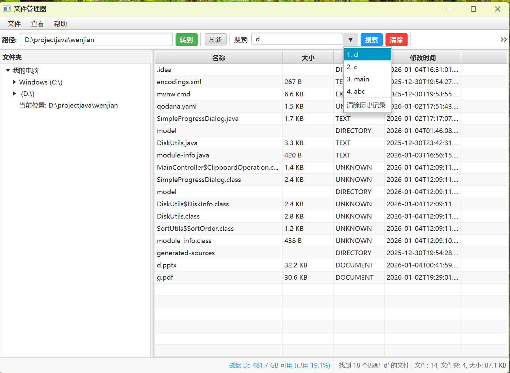
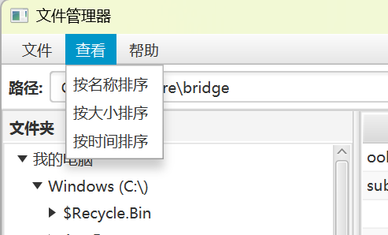
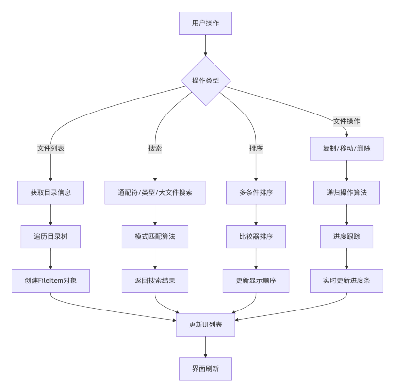
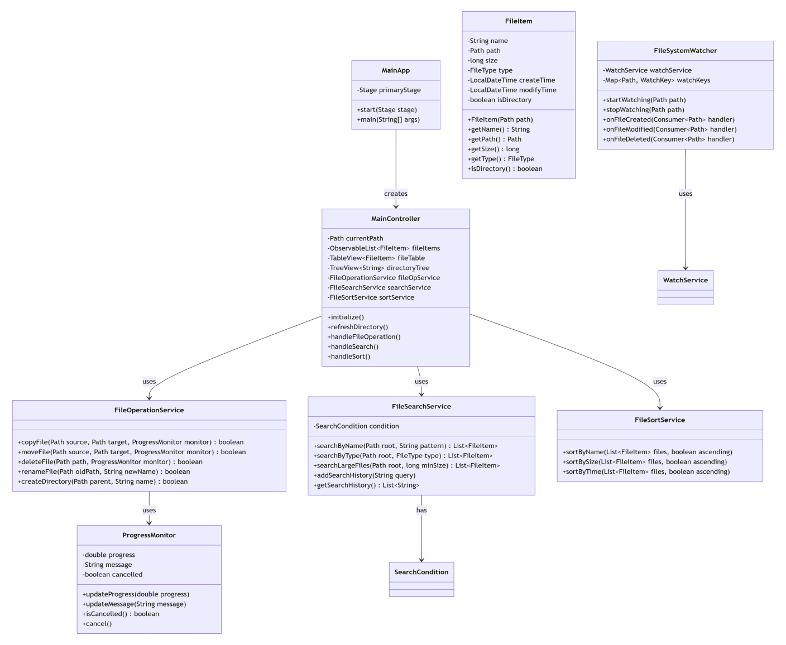

# 文件资源管理器 File Manager

一个基于 **JavaFX + Java IO/NIO + Maven** 开发的图形化文件资源管理器，支持文件浏览、目录树导航、搜索、排序、多选批量操作、复制进度显示、磁盘空间监控等常用功能。

本项目目标是实现一个类似 Windows 资源管理器的桌面文件管理工具，并在开发过程中强化 Java GUI、文件系统操作、多线程和异常处理能力。

---

## 项目预览

### 功能总览



### 主界面

主界面采用简洁的资源管理器式布局：顶部菜单栏与路径输入区，左侧目录树，右侧文件列表，底部显示磁盘空间、当前路径和文件/文件夹详细信息。



---

## 核心功能

### 1. 文件与文件夹操作

支持常见文件资源管理操作：

- 文件复制、移动、删除、重命名
- 文件夹创建、移动、删除、重命名
- 打开或运行指定文件
- 右键菜单、菜单栏、工具栏按钮等多入口操作
- 支持 `Ctrl` / `Shift` 多选
- 支持批量复制、粘贴、删除
- 文件复制过程中显示进度条和百分比





---

### 2. 目录树导航

左侧目录树支持展开磁盘和文件夹，用户可以双击进入指定目录。项目对系统盘访问、无权限文件夹和特殊文件夹做了异常处理，避免展开目录时程序崩溃。



---

### 3. 搜索功能

搜索模块支持：

- 按文件名搜索
- 通配符搜索
- 按文件类型搜索，例如图片、Word 文档、视频等
- 大文件搜索，例如查找大于 100MB 的文件
- 搜索历史记录下拉展示
- 搜索历史清除

为提升易用性，系统对用户输入进行了格式归一化处理。例如用户输入 `.java` 时，程序会自动转换成可识别的通配符搜索格式。



---

### 4. 排序与查看

文件列表支持按照以下条件排序：

- 名称
- 大小
- 创建时间 / 修改时间



---

### 5. 磁盘空间与文件详情显示

系统底部状态栏会实时显示磁盘剩余空间、磁盘占用率以及当前选中文件或文件夹的详细信息。


---

## 技术栈

| 类别 | 技术 |
|---|---|
| 编程语言 | Java |
| GUI 框架 | JavaFX |
| 构建工具 | Maven |
| 文件操作 | Java IO / NIO |
| 进程调用 | Process |
| 并发处理 | 多线程 / 后台任务 |
| 开发环境 | IntelliJ IDEA + JDK 21 |
| 运行环境 | JRE / JDK 21 |

---

## 架构设计

项目整体采用界面层、控制层、服务层和数据模型分离的方式组织代码：

```text
用户操作
  ↓
JavaFX UI 界面
  ↓
Controller 控制层
  ↓
FileOperationService / SearchUtils 等服务模块
  ↓
Java IO / NIO 文件系统操作
  ↓
刷新目录树、文件列表、状态栏
```

### 数据处理流程



### 类结构设计



---

## 关键实现

### 1. 通配符搜索

搜索功能支持通配符匹配，核心思路是：

1. 将用户输入的搜索模式转换为程序可识别的匹配表达式；
2. 遍历目录中的文件名；
3. 支持大小写不敏感匹配；
4. 对 `.java`、`java`、`*.java` 等不同输入格式做统一处理。

时间复杂度约为：

```text
O(m * n)
```

其中 `m` 为模式长度，`n` 为文件名长度。

---

### 2. 多条件排序

排序功能使用 Java 内置排序能力，底层主要基于 TimSort。可以按照文件名、大小和时间进行排序。

```text
时间复杂度：O(n log n)
空间复杂度：O(n)
```

---

### 3. 多线程文件操作

文件复制、搜索、目录扫描等耗时操作放在后台线程中执行，避免阻塞 JavaFX 主线程。复制多个文件时，界面会显示进度条和百分比。

---

### 4. 安全目录树加载

开发过程中，目录树展开系统盘时曾出现崩溃。最终通过以下方式解决：

- 使用更适合 Windows 文件系统场景的 `java.io.File`；
- 跳过无权限访问的文件夹；
- 对特殊目录添加异常捕获；
- 限制单个目录下加载的文件夹数量，避免卡顿；
- 增加错误日志，便于定位问题。

---

### 5. 防止事件循环与重复点击

为了避免目录树更新触发导航事件导致死循环，项目中增加了状态标志位控制，并加入了重复点击防护机制。

---

## 项目结构

```text
file-manager/
├── .mvn/                    # Maven Wrapper 配置
├── src/                     # 源代码
├── test/                    # 测试代码
├── pom.xml                  # Maven 项目配置
├── mvnw                     # Linux / macOS Maven Wrapper
├── mvnw.cmd                 # Windows Maven Wrapper
├── qodana.yaml              # 代码质量检查配置
└── README.md
```

---

## 运行环境

- JDK 21
- JRE 21
- IntelliJ IDEA 2025.2.1 或其他支持 JavaFX / Maven 的 IDE

---

## 运行方式

### 方式一：运行 Jar 包

将打包好的 `wenjian.jar` 复制到电脑上，然后执行：

```bash
java -jar wenjian.jar
```

也可以在资源管理器中双击 `wenjian.jar` 运行。

---

### 方式二：使用 Maven 构建运行

在项目根目录执行：

```bash
./mvnw clean package
```

Windows PowerShell 中可使用：

```powershell
.\mvnw.cmd clean package
```

构建完成后，生成文件一般位于：

```text
target/
```

---

## 项目亮点

- 实现了完整的桌面文件资源管理器基本功能；
- 支持目录树、文件列表、菜单栏、右键菜单、工具栏等多种交互入口；
- 支持搜索历史下拉展示，提升重复搜索效率；
- 支持磁盘剩余空间和占用率实时显示；
- 支持多选批量操作和复制进度反馈；
- 对系统盘权限、特殊文件夹、目录加载过多等问题做了异常处理；
- 通过多线程提升大目录扫描和文件复制时的界面流畅度。

---

## AI 辅助开发说明

本项目开发过程中使用了 DeepSeek 和通义灵码进行辅助开发：

- DeepSeek：用于功能设计建议、部分框架函数生成、Bug 修复思路；
- 通义灵码：用于检索项目中与某一功能相关的函数、检查接口和逻辑关系；
- 人工主导：最终功能取舍、代码整合、Bug 定位、逻辑调整和测试均由开发者完成。

在项目开发中也发现，当代码规模变大后，AI 生成代码可能出现前后逻辑冲突。因此需要开发者掌握整体架构，将问题拆小后再交给 AI 辅助解决。

---

## 开发过程简述

项目开发大致经历了以下阶段：

1. 项目立项与功能规划；
2. 学习 Java IO / NIO 与 JavaFX；
3. 搭建 Maven 项目结构；
4. 实现文件列表、CRUD 操作、搜索与排序；
5. 搭建 JavaFX 主界面；
6. 集成目录树、文件列表和状态栏；
7. 解决目录树崩溃、事件循环、搜索格式等问题；
8. 增加多选、批量操作、复制进度条和磁盘状态显示；
9. 完成集成测试、Bug 修复和打包发布。

---

## 总结

本项目实现了一个具有实用价值的图形化文件资源管理器。它不仅覆盖了 Java 文件系统操作、JavaFX 界面开发、Maven 项目构建、多线程任务处理等知识点，也完整经历了从需求分析、架构设计、功能实现、Bug 修复到最终打包的开发流程。


